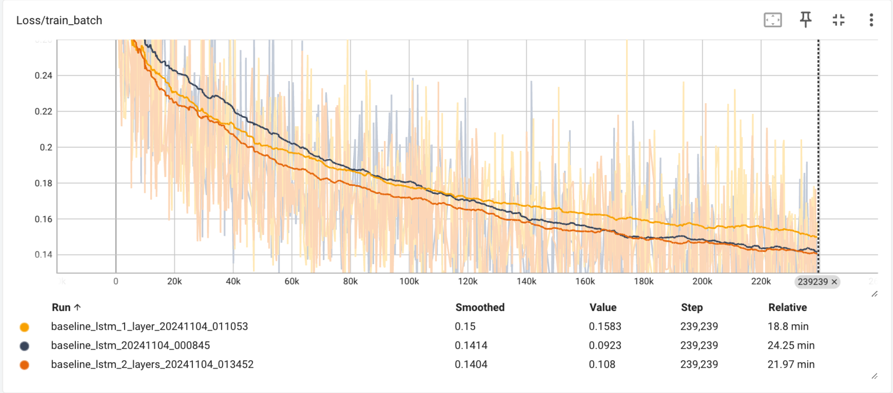

# ChildHope_DeepLearning

## Setup

### Prerequisites
- Python 3.11
- Poetry (Python package manager)

### Installation Steps

1. Clone the repository
    ```
    $ git clone https://github.com/your-repo/ChildHope_DeepLearning.git
    ```

2. Install poetry if not already installed
    * Unix/MacOS/WSL: 
        ```
        curl -sSL https://install.python-poetry.org | python3 -
        ```
    * Windows: 
        ```
        (Invoke-WebRequest -Uri https://install.python-poetry.org -UseBasicParsing).Content | py -
        ```

    New to Poetry? Check out the [beginner's guide](https://python-poetry.org/docs/basic-usage/).

3. Package Dependencies
    ```
    $ poetry install
    ```

## Project Structure
```
childhope/
├── models/                    # Neural network architectures
│   ├── baseline_lstm.py      # Reference LSTM implementation
│   ├── tide.py              # TiDE (Time-series Dense Encoder) implementation
│   └── your_model.py         # Add your new architectures here
├── data_processing/          # Data preprocessing utilities
│   ├── preprocessing.py      # Current preprocessing functions
│   ├── eda.py               # Exploratory Data Analysis utilities
│   └── your_processing.py    # Add your preprocessing methods here
└── common/                   # Shared utilities
    └── logger.py             # Logging configuration

experiments/                  # Different training approaches
├── baseline/                # Reference LSTM experiment
├── tide/                    # TiDE model experiments and visualization
└── your_experiment/         # Add your experiments here

tensorboard_logs/            # Experiment tracking and visualization
├── experiment_1_timestamp/  # Training/validation metrics, model behavior
└── experiment_2_timestamp/  # Learning rates, predictions, custom metrics

data/                        # Datasets (not tracked in git)
```

## Contributing

### Adding New Models
Place new model architectures in `childhope/models/`. The baseline LSTM provides a reference implementation for vital signs prediction.

### Adding New Preprocessing Methods
Preprocessing methods go in `childhope/data_processing/`. Current preprocessing includes:
- Time series resampling
- Missing value handling
- Train/validation/test splitting

The data splitting strategy ensures patient independence:
- Patients are randomly split into train (80%) and test (20%) sets
- All time series from a patient are kept together in either train or test
- Validation set is created from the training patients (not test patients)
- This prevents data leakage and ensures model evaluation on completely unseen patients

Feel free to add new methods that might improve data quality or model performance.

### Adding New Experiments
The `experiments/` directory contains different training approaches. Each experiment should:
- Have its own directory
- Log results to the common TensorBoard directory for easy comparison:
    ```python
    # Standard logging setup for all experiments
    experiment_name = "your_experiment_name"  # e.g., "lstm_attention", "transformer", etc.
    timestamp = datetime.datetime.now().strftime("%Y%m%d_%H%M%S")
    log_dir = os.path.join(os.path.dirname(__file__), "../../tensorboard_logs", experiment_name + "_" + timestamp)
    writer = SummaryWriter(log_dir)
    ```
- Use the following standard metrics for comparison:
    - Training loss
    - Validation loss (plotted together with training loss)
    - Learning rate
    - Any experiment-specific metrics

Take a look at the baseline LSTM experiment in `experiments/baseline/` for reference implementation, logging setup, and overall structure.

### Comparing Experiments in TensorBoard
To view and compare all experiments:
```bash
tensorboard --logdir=tensorboard_logs
```

This will display all experiments in the same TensorBoard interface. Here are some examples comparing two LSTM implementations - one with a single layer and another with two layers:

#### Training Loss Comparison

Track and compare training loss across different experiments to evaluate convergence rates and stability.

#### Validation Loss Comparison

Compare validation performance to assess generalization and identify potential overfitting.
